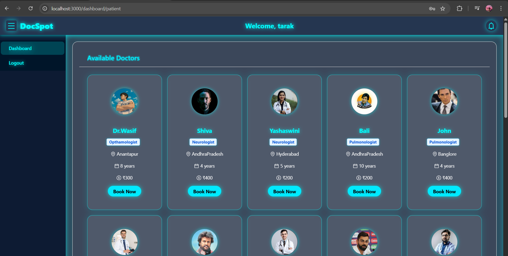
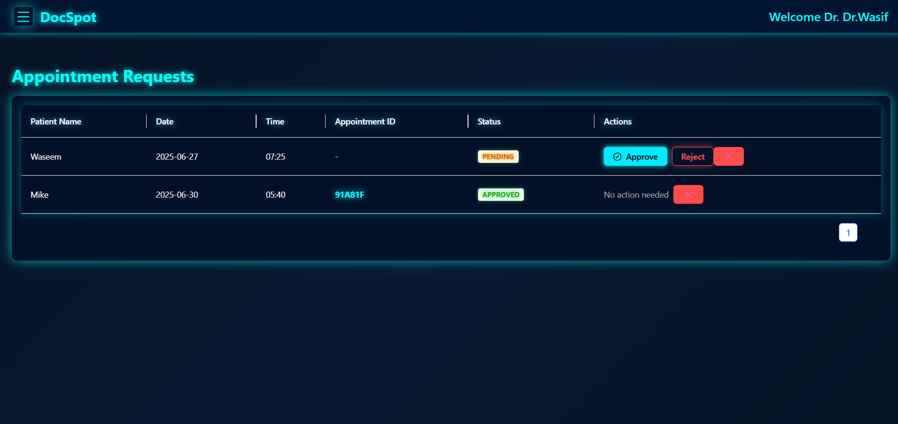
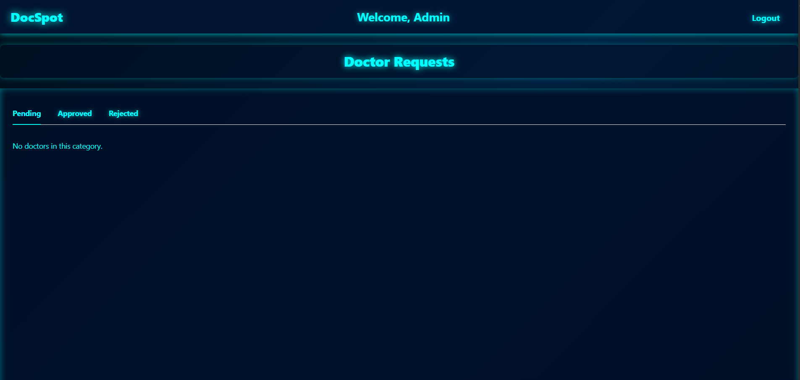
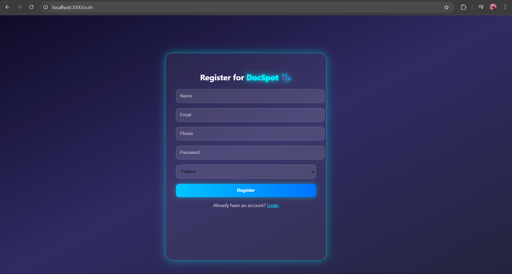
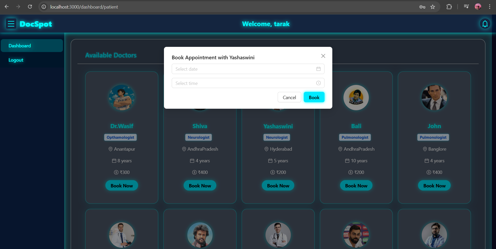
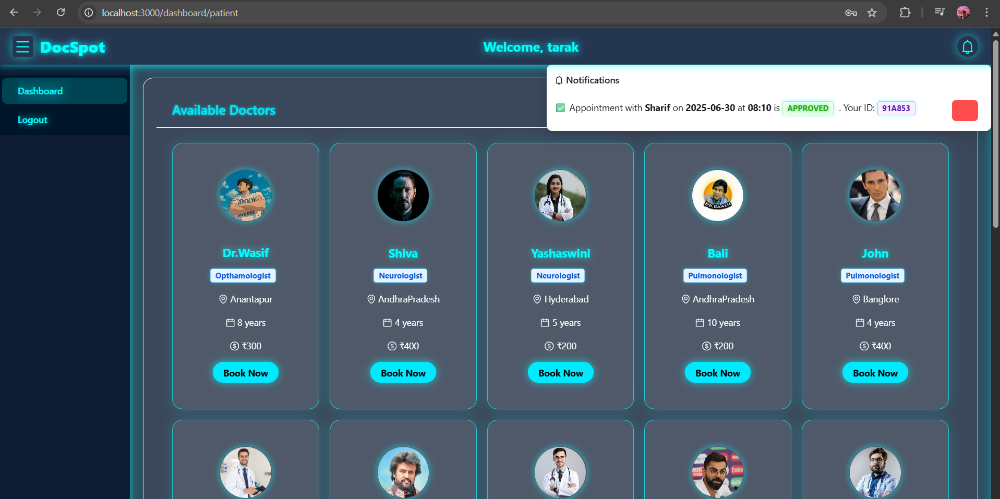

# 📘 DocSpot: Seamless Appointment Booking for Health

**DocSpot** is a full-stack web application that streamlines the process of booking medical appointments. It provides a user-friendly platform where patients can easily schedule appointments, doctors can manage their availability, and admins can oversee platform operations.

---

## 📌 Table of Contents

- [Features](#features)
- [Architecture](#architecture)
- [Tech Stack](#tech-stack)
- [Roles & Permissions](#roles--permissions)
- [Setup Instructions](#setup-instructions)
- [Application Flow](#application-flow)
- [Screenshots](#screenshots)
- [Prerequisites](#prerequisites)
- [License](#license)

## ✅ Features

- 📋 User Registration & Login (Customer, Doctor, Admin)
- 🔍 Browse & Filter Doctors
- 📅 Book Appointments with Real-time Availability
- 🗂 Upload Medical Documents
- 🔔 Notifications and Appointment Confirmations
- ⚙ Admin Approval for Doctors
- 📊 Dashboards for Users, Doctors, and Admins
- 🔄 Appointment Reschedule or Cancellation
- 📁 Visit Summaries and Follow-ups

---

## 🧱 Architecture

The app follows a **client-server model**:

- **Frontend:** React.js (with Material UI, Ant Design, Bootstrap)
- **Backend:** Node.js with Express.js
- **Database:** MongoDB
- **API Communication:** RESTful APIs using Axios
- **Date Management:** Moment.js

---

## 🔧 Tech Stack

- *Frontend*: React.js, Bootstrap, Material UI, Axios
- *Backend*: Node.js, Express.js
- *Database*: MongoDB, Mongoose
- *Authentication*: JWT
- *File Uploads*: Multer
- *Other*: Moment.js, Ant Design, React-Router
---

## 👥 Roles & Permissions

### 👤 Customer
- Register & Login
- Browse doctors
- Book appointments
- Upload documents
- Reschedule/cancel bookings

### 🧑‍⚕️ Doctor
- Requires admin approval
- Manage appointment requests
- Update appointment status
- Provide consultation summaries

### 👨‍💼 Admin
- Approve doctor registrations
- Monitor platform activity
- Enforce policy compliance

---

## ⚙️ Setup Instructions

### 1. Clone the repository
bash
git clone <repo-url>
cd book-a-doctor

### 2. Install Frontend Dependencies
bash
cd frontend
npm install

### 3. Install Backend Dependencies
bash
cd ../backend
npm install

### 4. Set Environment Variables

Create a `.env` file in the `backend` directory:
env
PORT=5000
MONGO_URI=your_mongodb_connection_string
JWT_SECRET=your_jwt_secret

### 5. Start Development Servers

**Backend**
bash
cd backend
npm start

**Frontend**
bash
cd frontend
npm start

Access the app at: [http://localhost:3000](http://localhost:3000)

---

## 🔄 Application Flow

### 🧑‍💻 User (Customer)
1. Registers and logs in
2. Views doctor listings
3. Filters by specialty/location
4. Books appointment, uploads documents
5. Gets confirmation and status updates

### 👨‍⚕️ Doctor
1. Applies and waits for admin approval
2. Logs in post-approval
3. Manages appointments, updates status
4. Adds post-visit summaries

### 👨‍💼 Admin
1. Reviews and approves doctor registrations
2. Oversees all users and appointments
3. Manages platform policies

---

## 🧪 Folder Structure

### 📁 Frontend
frontend/
├── public/
├── src/
│   ├── components/
│   ├── pages/
│   ├── utils/
│   └── App.js

### 📁 Backend
backend/
├── config/
│   └── config.js
├── controllers/
├── middleware/
│   └── authMiddleware.js
├── models/
│   └── (schemas for User, Doctor, Appointment)
├── routes/
├── server.js

---

## 📷 Screenshots

> Add screenshots of:
###  User Dashboard

### Doctor Dashboard

### 👨‍💼 Admin Dashboard

### Login / Register Pages

### Appointment Booking Form

### Confirmation Screen

---

## 📋 Prerequisites

Install the following tools before proceeding:

| Tool          | Link |
|---------------|------|
| Node.js & npm | [Download](https://nodejs.org/en/download/) |
| MongoDB       | [Download](https://www.mongodb.com/try/download/community) |
| React.js      | [Guide](https://reactjs.org/docs/create-a-new-react-app.html) |
| Moment.js     | [Guide](https://momentjs.com/) |
| Ant Design    | [Docs](https://ant.design/docs/react/introduce) |

---

## 📄 License

This project is for educational/demo purposes. Commercial use may require appropriate licensing and data compliance.